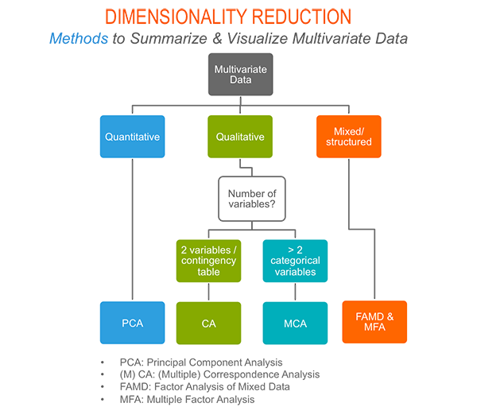
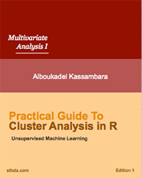
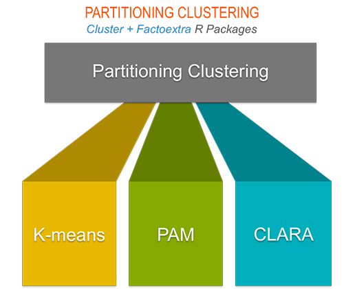

---
output:
  md_document:
    variant: markdown_github
---


```{r, echo = FALSE}
knitr::opts_chunk$set(
  collapse = TRUE,
  comment = "#>",
  fig.path = "tools/README-",
  warning = FALSE
)
```
   
    
[](https://travis-ci.org/kassambara/factoextra)
[](https://cran.r-project.org/package=factoextra)
[](https://cran.r-project.org/package=factoextra)
[](http://cranlogs.r-pkg.org/badges/grand-total/factoextra)
[](http://www.repostatus.org/#active)
[](https://github.com/kassambara/factoextra/pulls)
[](https://github.com/kassambara/factoextra/issues)
   
   
# factoextra : Extract and Visualize the Results of Multivariate Data Analyses
       
     
[**factoextra**](http://www.sthda.com/english/rpkgs/factoextra) is an R package making easy to *extract* and *visualize* the output of exploratory **multivariate data analyses**, including:    
     
1. [Principal Component Analysis (PCA)](http://www.sthda.com/english/articles/31-principal-component-methods-in-r-practical-guide/112-pca-principal-component-analysis-essentials/), which is used to summarize the information contained in a continuous (i.e, quantitative) multivariate data by reducing the dimensionality of the data without loosing important information.   
      
      
2. [Correspondence Analysis (CA)](http://www.sthda.com/english/wiki/correspondence-analysis-in-r-the-ultimate-guide-for-the-analysis-the-visualization-and-the-interpretation-r-software-and-data-mining), which is an extension of the principal component analysis suited to analyse a large contingency table formed by two *qualitative variables* (or categorical data).
        
        
3. [Multiple Correspondence Analysis (MCA)](http://www.sthda.com/english/wiki/multiple-correspondence-analysis-essentials-interpretation-and-application-to-investigate-the-associations-between-categories-of-multiple-qualitative-variables-r-software-and-data-mining), which is an adaptation of CA to a data table containing more than two categorical variables.
     
     
4. [Multiple Factor Analysis (MFA)](http://www.sthda.com/english/rpkgs/factoextra/reference/fviz_mfa.html) dedicated to datasets where variables are organized into groups (qualitative and/or quantitative variables).   
     
     
5. [Hierarchical Multiple Factor Analysis (HMFA)](http://www.sthda.com/english/rpkgs/factoextra/reference/fviz_hmfa.html): An extension of MFA in a situation where the data are organized into a hierarchical structure.
    
6. [Factor Analysis of Mixed Data (FAMD)](http://www.sthda.com/english/rpkgs/factoextra/reference/fviz_famd.html), a particular case of the MFA, dedicated to analyze a data set containing both quantitative and qualitative variables.
      
      
There are a number of R packages implementing principal component methods. These packages include: *FactoMineR*, *ade4*, *stats*, *ca*, *MASS* and *ExPosition*.   
    
However, the result is presented differently according to the used packages. To help in the interpretation and in the visualization of multivariate analysis - such as cluster analysis and dimensionality reduction analysis - we developed an easy-to-use R package named [factoextra](http://www.sthda.com/english/rpkgs/factoextra).
   
   

- The R package **factoextra** has flexible and easy-to-use methods to extract quickly, in a human readable standard data format, the analysis results from the different packages mentioned above.    
- It produces a **ggplot2**-based **elegant data visualization** with less typing. 
- It contains also many functions facilitating clustering analysis and visualization.

   
     
> We'll use i) the FactoMineR package (Sebastien Le, et al., 2008) to compute PCA, (M)CA, FAMD, MFA and HCPC; ii) and the factoextra package for extracting and visualizing the results.   
    
        
          
The figure below shows methods, which outputs can be visualized using the factoextra package. The official online documentation is available at: http://www.sthda.com/english/rpkgs/factoextra. 
     
     

     
     
## Why using factoextra?
   
1. The *factoextra* R package can handle the results of PCA, CA, MCA, MFA, FAMD and HMFA from several packages, for extracting and visualizing the most important information contained in your data.
     
     
2. *After PCA, CA, MCA, MFA, FAMD and HMFA, the most important row/column elements* can be highlighted using :  
  - their cos2 values corresponding to their quality of representation on the factor map
  - their contributions to the definition of the principal dimensions.
     
<span class = "success">If you want to do this, the factoextra package provides a convenient solution.</span>
     
     
3. *PCA and (M)CA are used sometimes for prediction problems* : one can predict the coordinates of new supplementary variables (quantitative and qualitative) and supplementary individuals using the information provided by the previously performed PCA or (M)CA. This can be done easily using the [FactoMineR](http://www.sthda.com/english/articles/31-principal-component-methods-in-r-practical-guide/112-pca-principal-component-analysis-essentials/) package. 
         
<span class="success">If you want to make predictions with PCA/MCA and to visualize the position of the supplementary variables/individuals on the factor map using ggplot2: then factoextra can help you. It's quick, write less and do more...</span>
      
      
4. *Several functions from different packages - FactoMineR, ade4, ExPosition, stats - are available in R for performing PCA, CA or MCA*. However, The components of the output vary from package to package. 

<span class = "success">No matter the package you decided to use, factoextra can give you a human understandable output.</span>
    
    
## Installing FactoMineR
    
The FactoMineR package can be installed and loaded as follow:   
    
    
```{r, eval = FALSE}
# Install
install.packages("FactoMineR")

# Load
library("FactoMineR")
```

     
     
## Installing and loading factoextra
        
        
- factoextra can be installed from [CRAN](https://cran.r-project.org/package=factoextra) as follow:
   
```{r, eval = FALSE}
install.packages("factoextra")
```
       
       
- Or, install the latest version from [Github](https://github.com/kassambara/factoextra)
     
         
```{r, eval=FALSE}
if(!require(devtools)) install.packages("devtools")
devtools::install_github("kassambara/factoextra")
```
     
     
- Load factoextra as follow :    
    
```{r}
library("factoextra")
```
      
      
## Main functions in the factoextra package
    
    
<span class="warning">See the online documentation (http://www.sthda.com/english/rpkgs/factoextra) for a complete list.</span>
      
      
      
      
      
### Visualizing dimension reduction analysis outputs
      
     


Functions | Description
--------- | -----------------------------------------------------------
*fviz_eig (or fviz_eigenvalue)* | Extract and visualize the eigenvalues/variances of dimensions.
*fviz_pca* | Graph of individuals/variables from the output of *Principal Component Analysis* (PCA).
*fviz_ca* | Graph of column/row variables from the output of *Correspondence Analysis* (CA).
*fviz_mca* | Graph of individuals/variables from the output of *Multiple Correspondence Analysis* (MCA).
*fviz_mfa* | Graph of individuals/variables from the output of *Multiple Factor Analysis* (MFA).
*fviz_famd* | Graph of individuals/variables from the output of *Factor Analysis of Mixed Data* (FAMD).
*fviz_hmfa* | Graph of individuals/variables from the output of *Hierarchical Multiple Factor Analysis* (HMFA).
*fviz_ellipses* | Draw confidence ellipses around the categories.
*fviz_cos2* | Visualize the quality of representation of the row/column variable from the results of PCA, CA, MCA functions.
*fviz_contrib* | Visualize the contributions of row/column elements from the results of PCA, CA, MCA functions.

    
   
### Extracting data from dimension reduction analysis outputs
    
    

Functions | Description
--------- | -----------------------------------------------------------
*get_eigenvalue* | Extract and visualize the eigenvalues/variances of dimensions.
*get_pca* | Extract all the results (coordinates, squared cosine, contributions) for the active individuals/variables from *Principal Component Analysis* (PCA) outputs.
*get_ca* | Extract all the results (coordinates, squared cosine, contributions) for the active column/row variables from *Correspondence Analysis* outputs.
*get_mca* | Extract results from *Multiple Correspondence Analysis* outputs.
*get_mfa* | Extract results from *Multiple Factor Analysis* outputs.
*get_famd* | Extract results from *Factor Analysis of Mixed Data* outputs.
*get_hmfa* | Extract results from *Hierarchical Multiple Factor Analysis* outputs.
*facto_summarize* | Subset and summarize the output of factor analyses. 

   
        
### Clustering analysis and visualization  
       
       

Functions | Description
--------- | -----------------------------------------------------------
*dist*(fviz_dist, get_dist) | Enhanced Distance Matrix Computation and Visualization.
*get_clust_tendency* | Assessing Clustering Tendency.
*fviz_nbclust*(fviz_gap_stat) | Determining and Visualizing the Optimal Number of Clusters.
*fviz_dend* | Enhanced Visualization of Dendrogram
*fviz_cluster* | Visualize Clustering Results
*fviz_mclust* | Visualize Model-based Clustering Results
*fviz_silhouette* | Visualize Silhouette Information from Clustering.
*hcut* | Computes Hierarchical Clustering and Cut the Tree
*hkmeans* (hkmeans_tree, print.hkmeans) | Hierarchical k-means clustering.
*eclust* | Visual enhancement of clustering analysis

     
## Dimension reduction and factoextra
      
As depicted in the figure below, the type of analysis to be performed depends on the data set formats and structures.  
      

        
    
In this section we start by illustrating classical methods - such as PCA, CA and MCA - for analyzing a data set containing continuous variables, contingency table and qualitative variables, respectively.
    
We continue by discussing advanced methods - such as FAMD, MFA and HMFA - for analyzing a data set containing a mix of variables (qualitatives & quantitatives) organized or not into groups.
    
    
Finally, we show how to perform hierarchical clustering on principal components (HCPC), which useful for performing clustering with a data set containing only qualitative variables or with a mixed data of qualitative and quantitative variables.
        
        
### Principal component analysis
     
     
- Data: *decathlon2* [in *factoextra* package]
- PCA function: *FactoMineR::PCA*()
- Visualization *factoextra::fviz_pca*()
     
     
<span class = "success">Read more about computing and interpreting principal component analysis at: [**Principal Component Analysis** (PCA)](http://www.sthda.com/english/articles/31-principal-component-methods-in-r-practical-guide/112-pca-principal-component-analysis-essentials/).</span>
     
     
1. **Loading data**
    
    
```{r}
library("factoextra")
data("decathlon2")
df <- decathlon2[1:23, 1:10]
```
    
    
2. **Principal component analysis**
    
```{r}
library("FactoMineR")
res.pca <- PCA(df,  graph = FALSE)
```
        
        
3. **Extract and visualize eigenvalues/variances**:  
    
    
```{r pca-eigenvalue, fig.width = 4.5, fig.height=3.5}
# Extract eigenvalues/variances
get_eig(res.pca)
# Visualize eigenvalues/variances
fviz_screeplot(res.pca, addlabels = TRUE, ylim = c(0, 50))
```
     
     
     
4.**Extract and visualize results for variables**:
    
    
```{r pca-variables, fig.width=4.5, fig.height=4.5}
# Extract the results for variables
var <- get_pca_var(res.pca)
var
# Coordinates of variables
head(var$coord)
# Contribution of variables
head(var$contrib)
# Graph of variables: default plot
fviz_pca_var(res.pca, col.var = "black")
```
      
      
It's possible to control variable colors using their contributions ("contrib") to the principal axes:   
     
     
```{r pca-variable-colors-by-contributions, fig.width=5, fig.height=4.5}
# Control variable colors using their contributions
fviz_pca_var(res.pca, col.var="contrib",
             gradient.cols = c("#00AFBB", "#E7B800", "#FC4E07"),
             repel = TRUE # Avoid text overlapping
             )
```
   

   
5. **Variable contributions to the principal axes**:   
    
    
```{r pca-variable-contributions, fig.show="hold", fig.width=3.5, fig.height=3.5}
# Contributions of variables to PC1
fviz_contrib(res.pca, choice = "var", axes = 1, top = 10)

# Contributions of variables to PC2
fviz_contrib(res.pca, choice = "var", axes = 2, top = 10)
```
    
    
6. **Extract and visualize results for individuals**: 
     
     
```{r principal-component-analysis-data-mining, fig.show="asis", fig.width=5.4, fig.height=4.5}
# Extract the results for individuals
ind <- get_pca_ind(res.pca)
ind
# Coordinates of individuals
head(ind$coord)
# Graph of individuals
# 1. Use repel = TRUE to avoid overplotting
# 2. Control automatically the color of individuals using the cos2
    # cos2 = the quality of the individuals on the factor map
    # Use points only
# 3. Use gradient color
fviz_pca_ind(res.pca, col.ind = "cos2", 
             gradient.cols = c("#00AFBB", "#E7B800", "#FC4E07"),
             repel = TRUE # Avoid text overlapping (slow if many points)
             )
# Biplot of individuals and variables
fviz_pca_biplot(res.pca, repel = TRUE)
```
         
         
7. **Color individuals by groups**:
         
         

```{r individuals-factor-map-color-by-groups, fig.width = 6}
# Compute PCA on the iris data set
# The variable Species (index = 5) is removed
# before PCA analysis
iris.pca <- PCA(iris[,-5], graph = FALSE)

# Visualize
# Use habillage to specify groups for coloring
fviz_pca_ind(iris.pca,
             label = "none", # hide individual labels
             habillage = iris$Species, # color by groups
             palette = c("#00AFBB", "#E7B800", "#FC4E07"),
             addEllipses = TRUE # Concentration ellipses
             )
```
     
     
    
### Correspondence analysis
     
- Data: *housetasks* [in factoextra]
- CA function *FactoMineR::CA*()
- Visualize with *factoextra::fviz_ca*()
       
       
<span class = "success">Read more about computing and interpreting correspondence analysis at: [**Correspondence Analysis** (CA)](http://www.sthda.com/english/wiki/correspondence-analysis-in-r-the-ultimate-guide-for-the-analysis-the-visualization-and-the-interpretation-r-software-and-data-mining).</span>
     
     
- **Compute CA**:  
   
```{r }
 # Loading data
data("housetasks")

 # Computing CA
library("FactoMineR")
res.ca <- CA(housetasks, graph = FALSE)
```
      
      
- **Extract results for row/column variables**:   
     
     
```{r, eval = FALSE}
# Result for row variables
get_ca_row(res.ca)
  
# Result for column variables
get_ca_col(res.ca)
```
    
    
- **Biplot of rows and columns**
      

```{r correspondence-analysis-biplot, fig.show='asis', fig.width=5, fig.height=5 }
fviz_ca_biplot(res.ca, repel = TRUE)
```
   
   
To visualize only row points or column points, type this:   
     
```{r, eval = FALSE}
# Graph of row points
fviz_ca_row(res.ca, repel = TRUE)

# Graph of column points
fviz_ca_col(res.ca)

# Visualize row contributions on axes 1
fviz_contrib(res.ca, choice ="row", axes = 1)
     
# Visualize column contributions on axes 1
fviz_contrib(res.ca, choice ="col", axes = 1)
```
    

      
### Multiple correspondence analysis
     
     
    
- Data: **poison** [in factoextra]
- MCA function **FactoMineR::MCA**()
- Visualization **factoextra::fviz_mca**()
       
       
<span class = "success">Read more about computing and interpreting multiple correspondence analysis at: [**Multiple Correspondence Analysis** (MCA)](http://www.sthda.com/english/wiki/multiple-correspondence-analysis-essentials-interpretation-and-application-to-investigate-the-associations-between-categories-of-multiple-qualitative-variables-r-software-and-data-mining).</span>
   
   
1. **Computing MCA**:
     

```{r}
library(FactoMineR)
data(poison)
res.mca <- MCA(poison, quanti.sup = 1:2,
              quali.sup = 3:4, graph=FALSE)
```
     
     
2. **Extract results for variables and individuals**:   
     
     
```{r, eval = FALSE}
# Extract the results for variable categories
get_mca_var(res.mca)

# Extract the results for individuals
get_mca_ind(res.mca)
```

     
3. **Contribution of variables and individuals to the principal axes**:   
     
     
```{r, eval = FALSE}
# Visualize variable categorie contributions on axes 1
fviz_contrib(res.mca, choice ="var", axes = 1)

# Visualize individual contributions on axes 1
# select the top 20
fviz_contrib(res.mca, choice ="ind", axes = 1, top = 20)

```
       
       
4. **Graph of individuals**
       
       
```{r mca-graph-of-individuals, fig.width = 5.4, fig.height=4.5}
# Color by groups
# Add concentration ellipses
# Use repel = TRUE to avoid overplotting
grp <- as.factor(poison[, "Vomiting"])
fviz_mca_ind(res.mca,  habillage = grp,
             addEllipses = TRUE, repel = TRUE)
```
      
      
5. **Graph of variable categories**:
     
     
```{r mca-graph-variables, fig.width=5.4}
fviz_mca_var(res.mca, repel = TRUE)
```
     
     
       
6. **Biplot of individuals and variables**:
      
      
```{r mca-biplot, fig.width=5.4, fig.height=5}
fviz_mca_biplot(res.mca, repel = TRUE)
```
      
      
### Advanced methods
     
     
The factoextra R package has also functions that support the visualization of advanced methods such:   
   
- Factor Analysis of Mixed Data (FAMD): : [FAMD Examples](http://www.sthda.com/english/rpkgs/factoextra/reference/fviz_famd.html)
- Multiple Factor Analysis (MFA): [MFA Examples](http://www.sthda.com/english/rpkgs/factoextra/reference/fviz_mfa.html)
- Hierarchical Multiple Factor Analysis (HMFA): [HMFA Examples](http://www.sthda.com/english/rpkgs/factoextra/reference/fviz_hmfa.html)
- [Hierachical Clustering on Principal Components (HCPC)](http://www.sthda.com/english/articles/31-principal-component-methods-in-r-practical-guide/117-hcpc-hierarchical-clustering-on-principal-components-essentials/)
     

## Cluster analysis and factoextra
         
To learn more about cluster analysis, you can refer to the book available at: [Practical Guide to Cluster Analysis in R](http://www.sthda.com/english/wiki/practical-guide-to-cluster-analysis-in-r-book)
              
              
<a href = "http://www.sthda.com/english/wiki/practical-guide-to-cluster-analysis-in-r-book"></a>
     
     
The main parts of the book include:   
    
- *distance measures*, 
- *partitioning clustering*,
- *hierarchical clustering*, 
- *cluster validation methods*, as well as, 
- *advanced clustering methods* such as fuzzy clustering, density-based clustering and model-based clustering.   
     
     
The book presents the basic principles of these tasks and provide many examples in R. It offers solid guidance in data mining for students and researchers.
      
      
      
### Partitioning clustering
    
    

     

```{r partitioning-clustering, fig.width = 5.4, fig.height=5}
# 1. Loading and preparing data
data("USArrests")
df <- scale(USArrests)

# 2. Compute k-means
set.seed(123)
km.res <- kmeans(scale(USArrests), 4, nstart = 25)

# 3. Visualize
library("factoextra")
fviz_cluster(km.res, data = df,
             palette = c("#00AFBB","#2E9FDF", "#E7B800", "#FC4E07"),
             ggtheme = theme_minimal(),
             main = "Partitioning Clustering Plot"
             )
```
    
 
<br/>   
<div class = "success">
Read more:   
   
1. [Cluster analysis in R: All what you should know](http://www.sthda.com/english/wiki/cluster-analysis-in-r-unsupervised-machine-learning).
    
2. [Partitioning cluster analysis](http://www.sthda.com/english/wiki/partitioning-cluster-analysis-quick-start-guide-unsupervised-machine-learning).
</div> 
<br/>
  

    
    
### Hierarchical clustering
    

```{r hierarchical-clustering, fig.width = 5.4, fig.height=5}
library("factoextra")
# Compute hierarchical clustering and cut into 4 clusters
res <- hcut(USArrests, k = 4, stand = TRUE)

# Visualize
fviz_dend(res, rect = TRUE, cex = 0.5,
          k_colors = c("#00AFBB","#2E9FDF", "#E7B800", "#FC4E07"))
```
      
      
<br/>   
<div class = "success">
Read more:   
   
1. [Cluster analysis in R: All what you should know](http://www.sthda.com/english/wiki/cluster-analysis-in-r-unsupervised-machine-learning)
    
2. [Hierarchical clustering essentials](http://www.sthda.com/english/wiki/hierarchical-clustering-essentials-unsupervised-machine-learning)
</div> 
<br/>
      
      
### Determine the optimal number of clusters
      
      
   
```{r determine-the-number-of-clusters-gap-statistics, fig.width = 4, fig.height=3}
# Optimal number of clusters for k-means
library("factoextra")
my_data <- scale(USArrests)
fviz_nbclust(my_data, kmeans, method = "gap_stat")
```
      
      
## Acknoweledgment
   

I would like to thank [Fabian Mundt](https://github.com/inventionate) for his active contributions to factoextra.

We sincerely thank all developers for their efforts behind the packages that **factoextra** depends on, namely,
[ggplot2](https://cran.r-project.org/package=ggplot2) (Hadley Wickham, Springer-Verlag New York, 2009), [FactoMineR](https://cran.r-project.org/package=FactoMineR) (Sebastien Le et al., Journal of Statistical Software, 2008), [dendextend](https://cran.r-project.org/package=dendextend) (Tal Galili, Bioinformatics, 2015), [cluster](https://cran.r-project.org/package=dendextend) (Martin Maechler et al., 2016) and more .....
      
      
      
## References
   
- H. Wickham (2009). ggplot2: Elegant Graphics for Data Analysis. Springer-Verlag New York.
- Maechler, M., Rousseeuw, P., Struyf, A., Hubert, M., Hornik, K.(2016).  cluster: Cluster Analysis Basics and Extensions. R package version 2.0.5.
- Sebastien Le, Julie Josse, Francois Husson (2008). FactoMineR: An R Package for Multivariate Analysis. Journal of Statistical Software, 25(1), 1-18. 10.18637/jss.v025.i01
- Tal Galili (2015). dendextend: an R package for visualizing, adjusting, and comparing trees of hierarchical clustering. Bioinformatics. DOI: 10.1093/bioinformatics/btv428
       
     