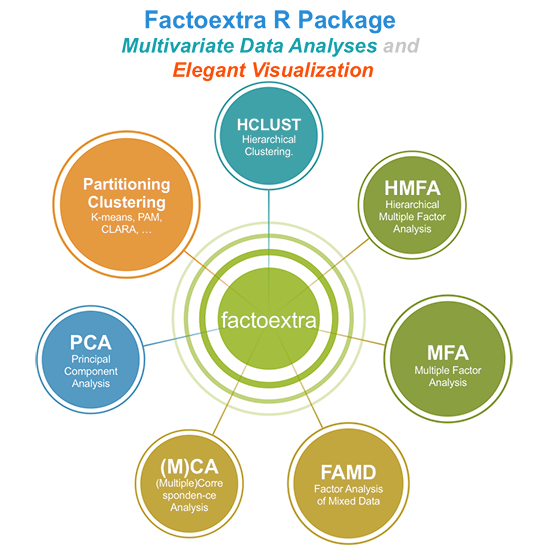

[](https://travis-ci.org/kassambara/factoextra) [](https://cran.r-project.org/package=factoextra) [](https://cran.r-project.org/package=factoextra) [](http://cranlogs.r-pkg.org/badges/grand-total/factoextra) [](http://www.repostatus.org/#active) [](https://github.com/kassambara/factoextra/pulls) [](https://github.com/kassambara/factoextra/issues)

factoextra : Extract and Visualize the Results of Multivariate Data Analyses
============================================================================

Provides some easy-to-use functions to extract and visualize the output of multivariate data analyses, including PCA (Principal Component Analysis), CA (Correspondence Analysis), MCA (Multiple Correspondence Analysis), FAMD (Factor Analysis of Mixed Data), MFA (Multiple Factor Analysis) and HMFA (Hierarchical Multiple Factor Analysis) functions from several packages : PCA, CA, MCA, MFA, HMFA \[FactoMineR\]; prcomp and princomp \[stats\]; dudi.pca, dudi.coa, dudi.acm \[ade4\]; ca \[ca\]; corresp \[MASS\]; epPCA, epCA, epMCA \[ExPosition\]. It contains also many functions for simplifying clustering analysis workflows. The ggplot2 plotting system is used. See <http://www.sthda.com/english/rpkgs/factoextra> for more information, documentation and examples.



Installation
------------

Install from [CRAN](https://cran.r-project.org/package=factoextra) as follow:

``` r
install.packages("factoextra")
```

Or, install the latest version from [GitHub](https://github.com/kassambara/factoextra):

``` r
# Install
if(!require(devtools)) install.packages("devtools")
devtools::install_github("kassambara/factoextra")
```

Geting started
--------------

Find out more at <http://www.sthda.com/english/wiki/factoextra-r-package>
